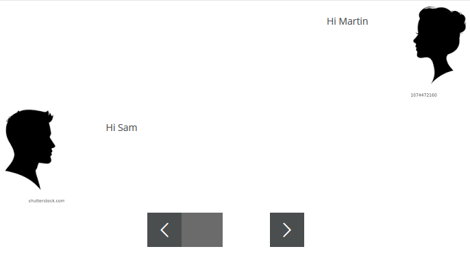

# adapt-scenario  

A scenario conversation component. Can be used in presenting the probable effects of one or more characters in situation analysis.

### Installation
First, be sure to install the [Adapt Command Line Interface](https://github.com/cajones/adapt-cli), then from the command line run:-

    adapt install scenario

Or, download the ZIP and extract into the src > components directory and run an appropriate Grunt task.

### Demo

https://kunjsharma.github.io/#/id/co-00

### Attributes

[**core model attributes**](https://github.com/adaptlearning/adapt_framework/wiki/Core-model-attributes): These are inherited by every Adapt component. [Read more](https://github.com/adaptlearning/adapt_framework/wiki/Core-model-attributes).

**_component** (string): This value must be: `scenario`.

### Limitations

Developed to <b>work with framework only</b>. Probably, only `properties.schema` requires to edit compatiblity with authoring tool. Contributors are welcome.

### Browser/platform specification

Intended to develop standard Adapt browser/devices specifications.

----------------------------
**Version number:**  3.0.0  
**Framework versions:** 5.0.0+  
**Author/maintainer:** Kunj <kunjsharma@hotmail.com>  
